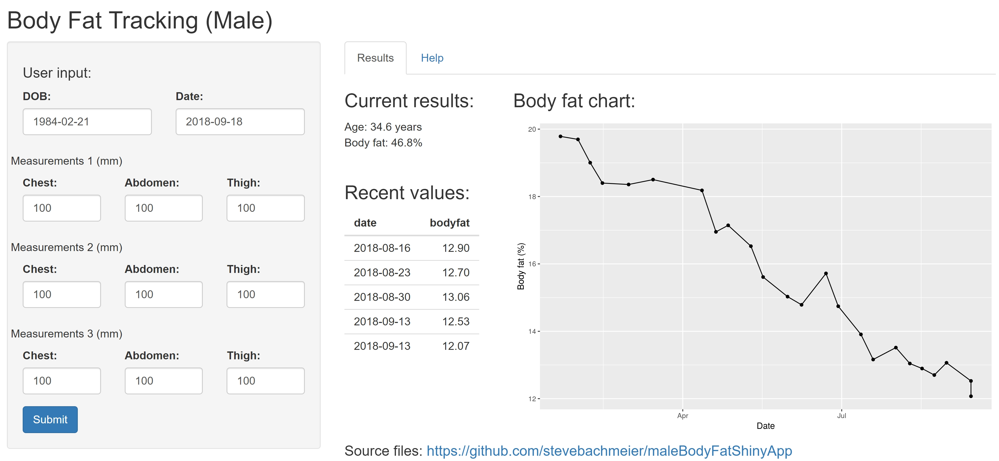

Male Body Fat Calculator Using the Jackson-Pollock 3-fold Method
========================================================
author: Steve Bachmeier
date: September 13, 2018
autosize: true

Background
========================================================

<small>In recent years there has been a significant increase in the amount of health-related data available to users. Fitbits, heartrate monitors, smart scales, etc are now low cost and easily found online and in stores. Further, apps that track health like Google Fit provide users with loads of data and they attempt to make sense of it.

Unfortunately, one area that still is not calculated accurately using sensors and apps is body fat percentage. This is, literally, the percentage of your overall mass that is made up by body fat. While there are low-cost smart scales that use electrical resistance to approximate it and high-cost testing (eg submersion) that can get better results, one method that is  often overlooked is by measuring skin folds using body fat calipers.</small>


<small>Reference: https://www.bodybuilding.com/content/how-to-measure-your-body-fat.html</small>

Motivation
========================================================

<small>Using a low cost set of body fat calipers, body fat percentage for men can be easily calculated using the Jackson-Pollock 3-fold method. 

Reference: Generalized equations for predicting body density of men, Jackson, A.S. and Pollock, M.L., Accepted 28 February 1978, British Journal of Nutrition.

The equation outlined in their research is simple:

Body Density = 1.10938 - <br>
(0.0008267 * Skinfold Sum) + <br>
(0.0000016 * square of Skinfold Sum) - <br>
(0.0002574 * Age)

Body Fat (%) = (495 / Body Density) - 450 

**While this is a simple equation, nobody wants to do the math every time!**</small>


Solution
========================================================

<small>We've created a clean and simple-to-use solution for solving the ugly Jackson-Pollock 3-fold method for calculating body fat percentage in males. Our app is hosted online and can be accessed from anywhere - all the user must do is take the relevant measurments, input the data, and click submit! The app will do the rest and provide the estimated body fat percentage as well as a dynamic plot of body fat over time.

https://stevebachmeier.shinyapps.io/bodyFat/</small>



Example
========================================================


<small>Let's say a user has been tracking his body fat for a few months. On January first, he inputs his new measurements:</small>


```
        date c1 a1 t1 c2 a2 t2 c3 a3 t3
1 2018-01-01 10 44 14 10 38 14 10 40 15
```


<small>Uh oh, it looks like the holiday season did some damage!</small>
